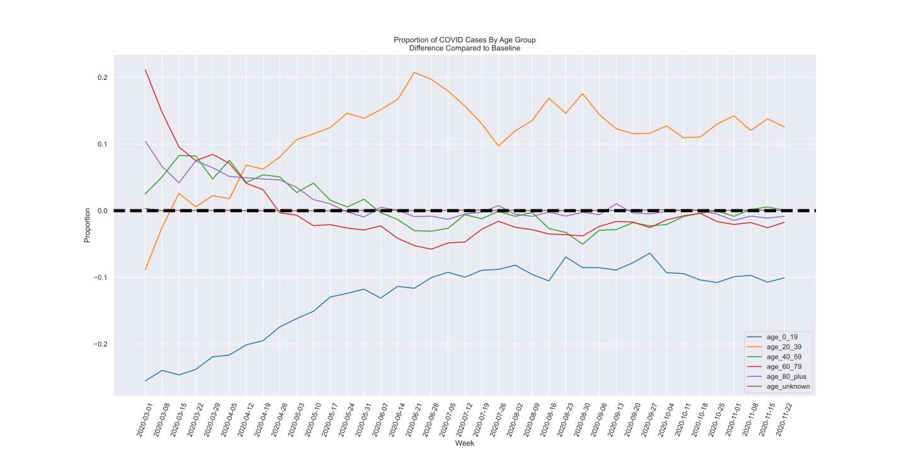

A recent Seattle Times article [detailing the age aspect of COVID](https://www.seattletimes.com/seattle-news/health/public-health-officials-enlist-youth-to-slow-the-rapid-spread-of-covid-19-among-young-people-in-seattle/) showed this graphic, covering what proportion of COVID cases are happening by age group over time:

This is a great example of something I call ***data without insight***. Yes, directly, folks aged 20-39 account for 40% of COVID cases as of late, but if folks aged 20-39 account for 40% of the population, is that really an interesting stat?

This is another case of where **a simple and effective baseline** can really bring life to your data. When we add this additional datapoint and frame the data in context of this baseline, we can get this plot, where you can directly see that yes, absolutely the 20-39 age group is punching above their weight in terms of COVID prevalence.

**As a bonus**, you get additional insight: the 0-19 age group is well below expectation, which isn't clear from the original plot. This is extremely important for everyone to both understand the current state of COVID and see how it can change in the future. 

[Check out my analysis](https://github.com/pauldria/myraff/blob/master/analyses/20201206-wa-covid-by-age/Communicating%20COVID%20By%20Age.ipynb) to see how easy it is to change the data to get much better insight. This is just one of many ways I can help you turn your data into action. 

[Contact Me](mailto:paul+consulting@myraff.com?subject=Interested%20in%20Effective%20Data%20Consulting) to find out more about how Effective Data Consulting can transform your business via this technique and many others. 
